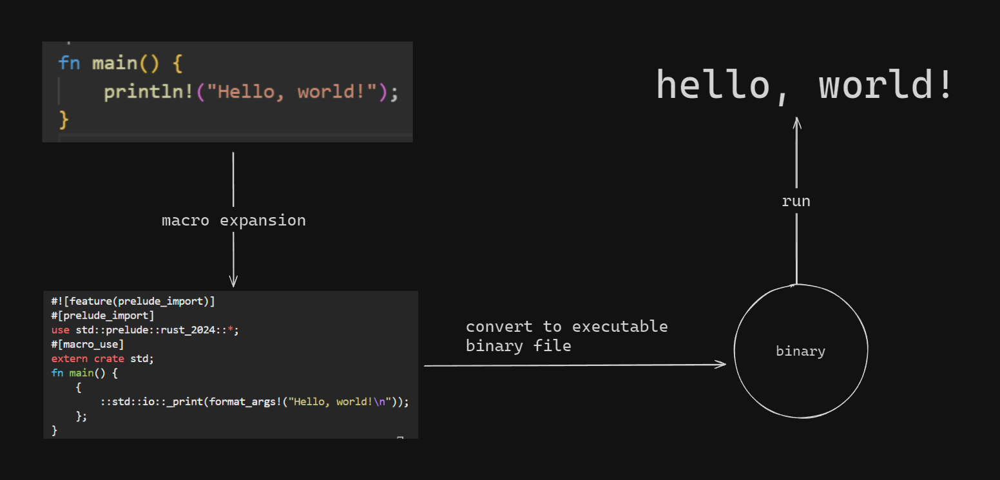

# Analyzing the Print Macro in Rust

This Cargo project analyzes the `print` macro.

In Rust, we always print using `println!` or `print!`.

The exclamation mark (`!`) is what makes these macros.

This is the simple program being run in this project:

```rust
fn main() {
    println!("Hello, world!");
}
```

What gets converted into binary (and then executed) is an expanded version of this program.

We run `cargo expand` to see the macros expanded:

```rust
#![feature(prelude_import)]
#[prelude_import]
use std::prelude::rust_2024::*;
#[macro_use]
extern crate std;
fn main() {
    {
        ::std::io::_print(format_args!("Hello, world!\n"));
    };
}
```

As we can see, the `println!` was converted into this somewhat complex code where multiple crates are being used just to print this one thing.

These are macros.

Then this expanded code is converted into an executable binary file which is then run.

The binary file is created at `target/debug/print-macro` after running `cargo build`.

Here is a diagram illustrating the process:

 